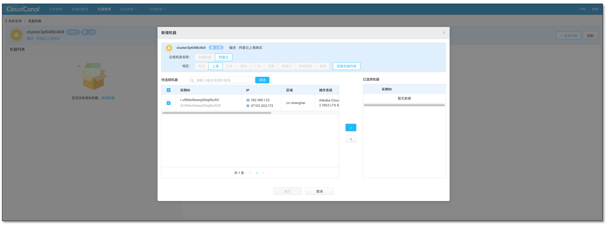

CloudCanal 支持自建机器(VM、物理机、开发机)和云托管主机(ECS、EC2等)作为数据迁移同步机器，本文档简要介绍如何添加云托管主机到 CloudCanal 中，以阿里云 ECS 为示例。

## 添加云托管机器

### 创建集群

- 创建集群入口
  

- 填写集群描述，选择 **阿里云** 环境和机器所在 **区域**
  

### 添加机器

- 进入对应集群 **机器列表**，点击右上角 **添加机器**，获取机器列表并选择需要添加的 ECS。
  

- 确定添加所选 ECS 后，CloudCanal 将会自动安装客户端到节点上，并启动。
  

### 检查是否正常启动

- 安装结束后，CloudCanal 由 **等待上线** 状态转变成 **在线** 状态，节点旁常亮**绿色小圆点**。
  