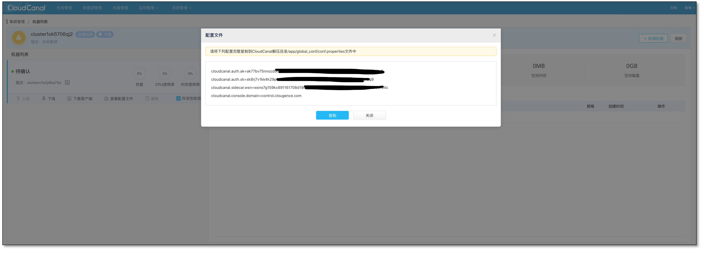

CloudCanal 支持自建机器(VM、物理机、开发机)和云托管主机(ECS、EC2等)作为数据迁移同步机器，本文档简要介绍如何添加自建机器到 CloudCanal 中，以本地开发机(Mac)为示例，云托管机器以阿里云 ECS 为示例。

## 添加自建机器

添加自建机器请先在目标机器上安装 JDK 8+ , CloudCanal 强依赖 java 环境。

### 创建集群

- 创建集群入口
  
 
- 填写集群描述并选择 **自建机房**
  

### 生成节点唯一标识

- 进入对应集群 **机器列表** ，点击右上角 **添加机器**，**生成机器唯一标识**
  

- 创建成功后，此时只是生成了机器唯一标识以及核心配置，并没有对应物理节点
  

### 下载客户端包并安装

- 点击 **下载客户端** ，因 Hive 客户端依赖较大，目前客户端包 300 MB ，不断优化中
  
 
- 下载后的包请放置某一个用户目录下，解压并编辑核心配置文件 **~/app/global_conf/conf.properties**
  

### 查询并填充身份信息

- 点击页面 **查看配置文件** 按钮，填写短信验证码即获取到机器核心配置
  
 
- 复制内容到刚打开的 **~/app/global_conf/conf.properties** ,保存
  

### 启动客户端

- 进入客户端启动目录，并执行启动脚本 **~/app/sidecar/bin/startSidecar.sh**
  

### 检查是否正常启动

- 通过本地日志(**~/logs/cloudcanal/sidecar/sidecar.log**) 或页面观察节点是否正常启动
  