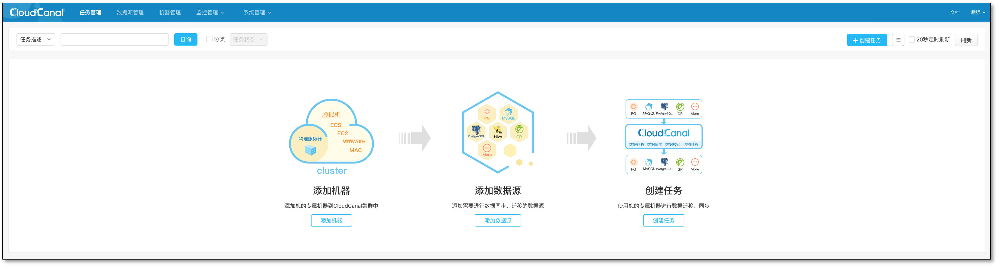
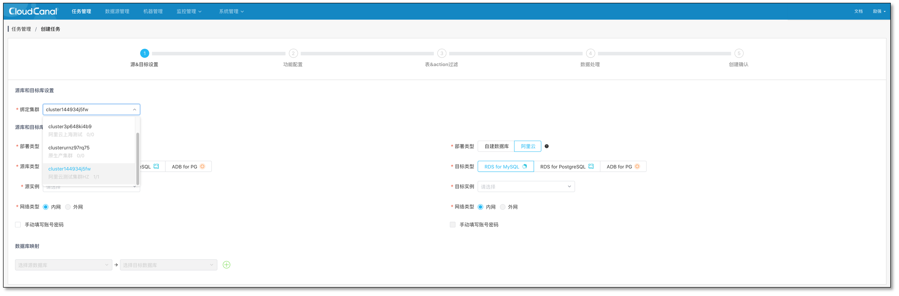
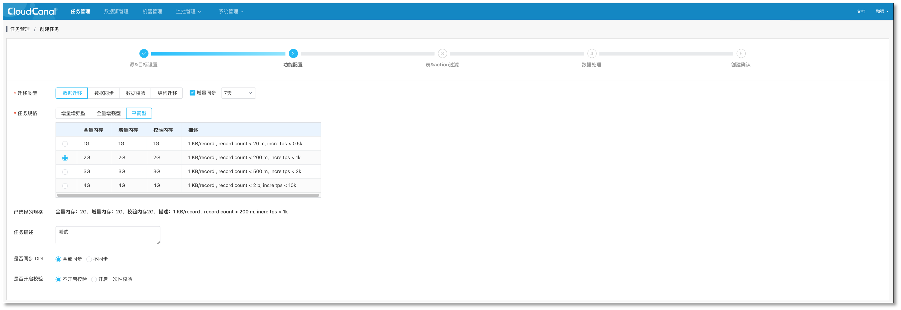
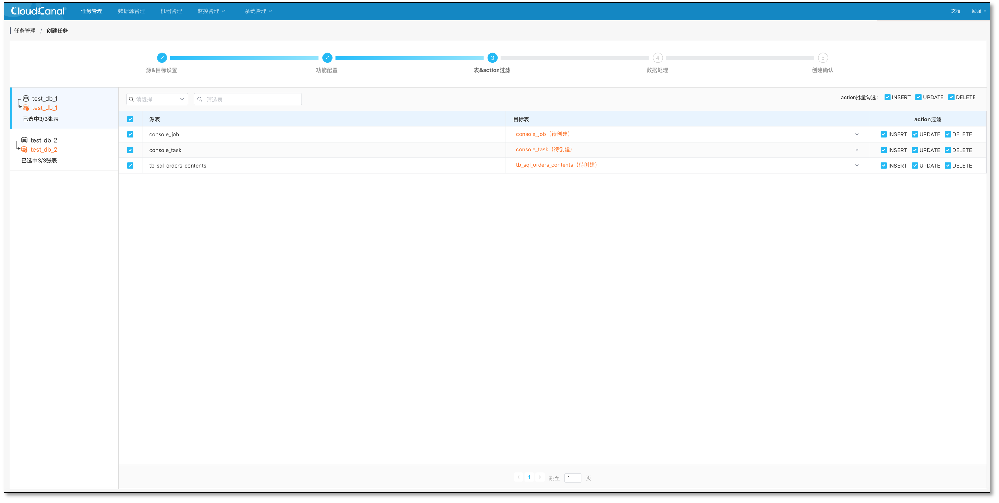
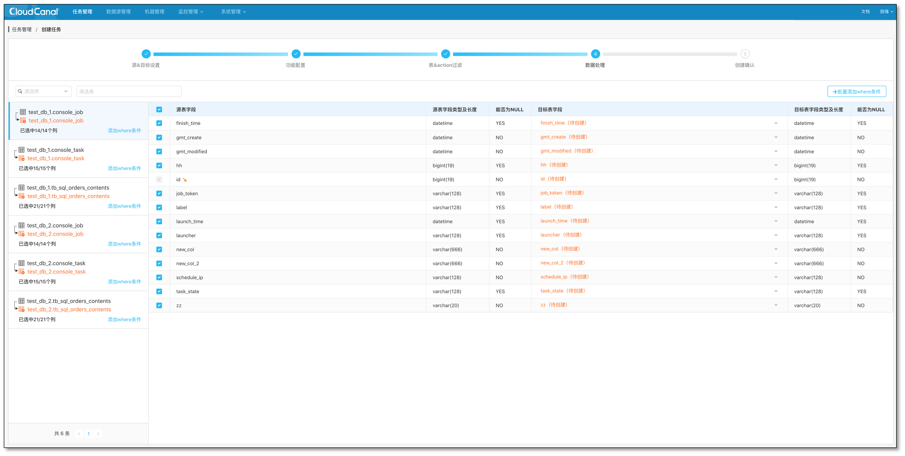
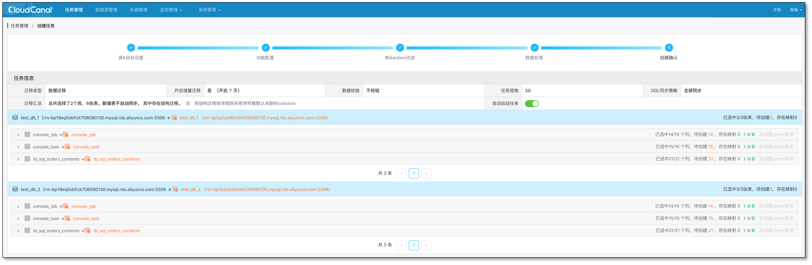
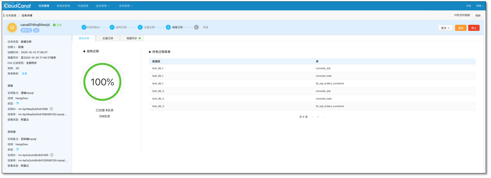
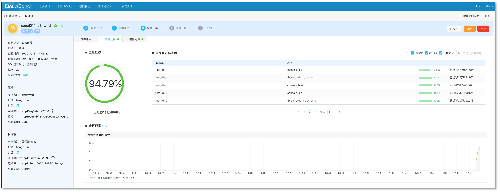
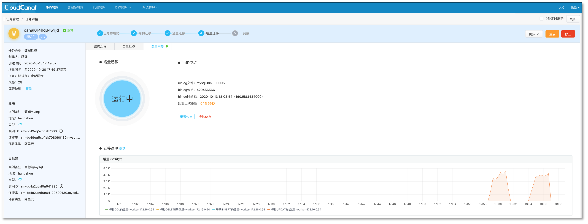

本文介绍如何创建一个带结构迁移、全量数据初始化和数据校验的数据同步任务，以本地开发机(Mac)迁移同步本地 MySQL 到 MySQL 为示例。

### 功能入口

- 开始创建任务

  

### 选择数据源

- 选择任务运行的 **绑定集群** ，如果所选有多个节点，CloudCanal 将会启动正常[两级容灾调度](product_arch.md)，如果只有单个节点，CloudCanal 只会有单级容灾调度。

  

- 选择源和目标数据源，并分别 **测试数据源** ，选择数据库或 Schema 等信息 , CloudCanal 支持多 Schema 迁移同步。

  

### 选择数据流动类型

- CloudCanal 支持数据迁移、数据同步、结构迁移、数据校验等多阶段数据流动业务，并且不断添加中，此阶段即选择数据流动业务类型。
- 规格和计费无关，在机器资源充足的情况下，可选大规格，性能好、稳定性高。任务较多时，考虑到机器利用率，可配置具备特定数据特征的规格。

  

### 选择数据表

- 选择表名映射、选择、特定操作过滤。

  

### 选择列

- 选择迁移列，也可设定**按条件过滤迁移同步的数据**

  

### 创建确认

- 确认任务内容的选择，默认任务创建后自动启动并流转，也可选择创建后暂不启动

  

### 创建成功

- 创建后如果为自动启动任务，任务进度条将逐渐变换

  

- 也可以进入任务详情查看具体任务运行信息

  

  

  

