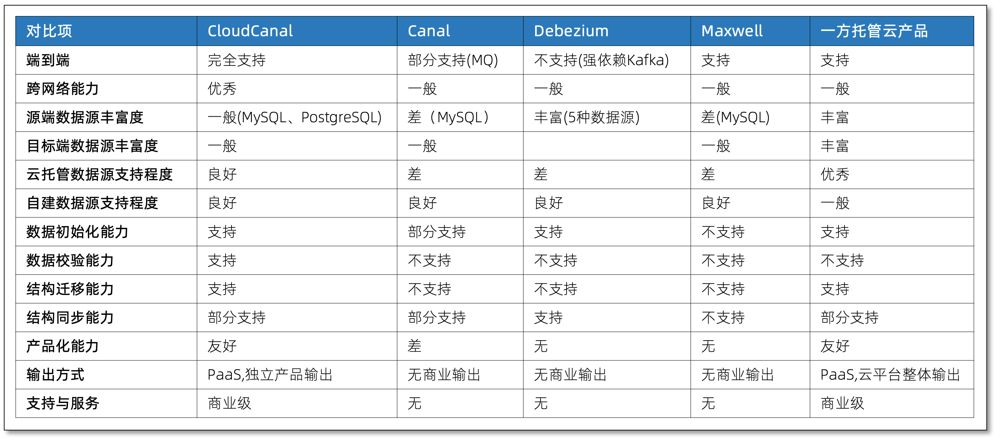

---
id:product_advantage
title: 产品优势
---

CloudCanal 具备安全、便利、中立、稳定、全面等特点，和市场主流产品对比，也具备不错的竞争力，并且快速成长中。本文通过优势介绍和竞品对比两方面来介绍。

## 核心优势

### 更安全

CloudCanal 将数据流动动作完全放置于用户私有环境下，数据不出该网络，无论是本地开发环境、云上 VPC 、自建机房环境都能很好使用。
客户端单向(出)访问管控,通信链路通过 tls 加密,并采用标准 AccessKey 和 SecurityKey 认证与鉴权,用户所涉及资源均具备良好隔离。

### 更便利

对于云托管 VM (如阿里云 ECS),全自动安装客户端即可运行数据流转任务，对于自有机器(如本地服务器),只需下载客户端并填充节点身份信息,即可运行。
无论是多阶段复杂数据流转，还是简单结构迁移，无论是长周期数据同步，还是单次数据全量迁移，CloudCanal 都能够流畅配置，5分钟内运行。

### 更中立

对于 CloudCanal 已经支持的数据源，还是即将支持的数据源，CloudCanal 秉承中立的原则
- 开源与托管数据源并重，让用户自由选择、搭配风险
- 支持数据进与出，让业务尝试数据库无后顾之忧(vendor lock-in avoiding)
- 运行环境对齐，云托管 VM、自有物理机、本地开发机(Mac/Ubuntu) 都能运行
- 私有输出零依赖，不强绑定任何平台、体系，平等支持各云平台和私有环境

### 更稳定

CloudCanal 采用 E2E(end-to-end),基于租约的容灾,自动重试等机制让数据流动链路更加稳定
- E2E 模式将链路缩到最短，没有分布式流式计算引擎，没有消息中间件，只为可靠、实时传递数据到对端数据源(对端可搭配流式计算引擎、消息中间件等)
- 分布式场景下，基于租约的一致性动作是相对可靠的方式，CloudCanal 将容灾探测、调度(手动/自动)做得更加可靠、可控
- 自动重试机制让长距离数据传输同步更加少让人操心，99% 的问题得到更加快速的解决

### 更全面

CloudCanal 的功能完整性和开发团队专业性让其更加全面。
尽力补齐数据源到数据源的核心能力，结构迁移/同步、数据初始化(全量)、数据同步和数据校验一个都不能少(部分能力补齐中)。
团队成员既有数据库内核开发出身，也有超大规模实时数据同步开发运维经验加持，更具备专业做云计算产品经验和能力。懂数据库，懂超大规模，懂云产品商业和服务模式。

## 竞品对比

- 注:因各产品动态发展中以及资料不对称，表中信息有可能过时，仅供参考。

