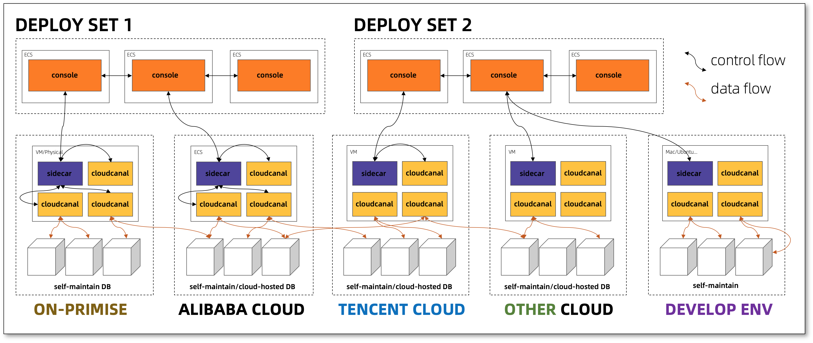
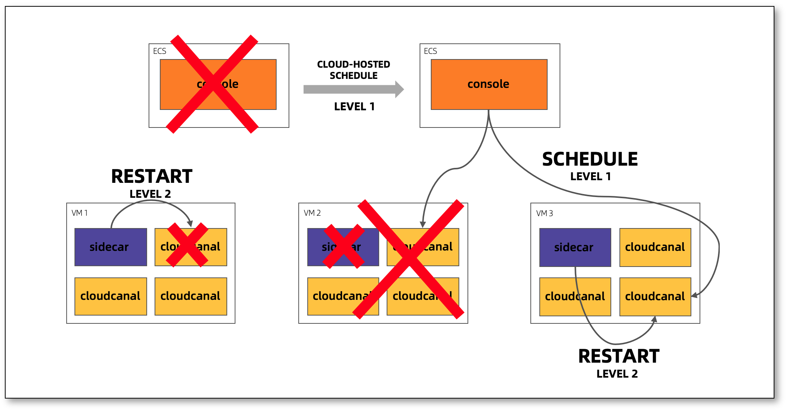
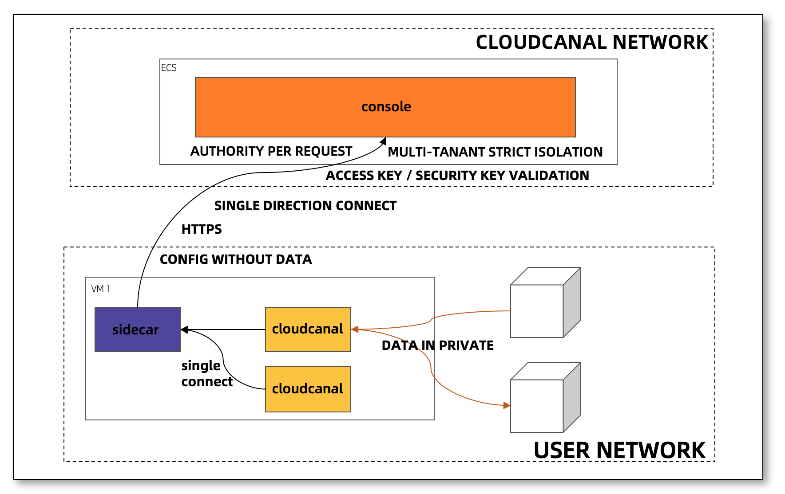

---
id:product_arch
title: 产品架构
---

CloudCanal 产品架构整体体现为多租户、分布式的特点，目标是解决用户在各个网络环境下、数据在各个数据库或数据源间流动的需求。
本文从整体架构、容灾方案、网络方案简要介绍 CloudCanal 是如何达成这个目标。

## 整体架构

CloudCanal 组件分为 **Console** , **Sidecar** 和 **Server** , 其中 Console 是集中化的管控服务, 以集群方式存在。
Sidecar 和 Server 部署具体迁移同步节点上，一个节点通常为一台 VM，或物理机，或云托管主机(ECS,EC2等)，一个节点上只会有一个
Sidecar 进程，而 Server 进程有 0~n 个。

Console 包含了 CloudCanal 所有的产品化服务，包括生命周期管理、容灾调度、监控告警、流程状态机流转、机器和数据源管理、用户权限等，
其中用户资源被很好地隔离，所有操作被鉴权、审计记录。

Sidecar 进程单向访问 Console,其职责包括获取本用户需要运行的任务配置、收集和上报运行中任务的状态、执行任务的健康检查等工作。

Server 进程具体执行数据流动任务,根据不同类型的任务,Server 将运行不同类型的任务逻辑,包括全量数据迁移、增量数据同步、数据校验等，
同时它也会不断上报任务的执行位点、资源使用状况等。

## 容灾方案

CloudCanal 容灾主要包含两个方面:管控容灾和任务容灾。

管控容灾，CloudCanal 主要是通过集群化部署解决，有状态部分交由管控数据库解决。

任务容灾，包含 2 级调度，1 级容灾交于底层 IaaS , 如 VM 自动迁移重启, 在这一层容灾 Action , CloudCanal 主要的职责
是做好 VM 迁移重启后系统能够自动拉起保姆进程 Sidecar，再由 Sidecar 的 2 级容灾机制自动维护属于本节点的任务状态。2 级容灾包含迁移同步
节点的任务进程状态维护和保姆进程退出后管控介入任务调度的动作，其中前者完全交于 Sidecar 进行维护，后者属于 Sidecar 失活之后，Console 介入做节点级别调度。

CloudCanal 管控判定 Sidecar 失活依据为租期，节点上的任务也会在一定租期后自动响应本节点 Sidecar 失活现象，自动退出，此动作能够规避网络隔离双跑风险。

## 网络方案

CloudCanal 为了适应多租户不同网络隔离要求，并且结合现有用户网络状况，选择了安全的用户节点反向链接管控方式进行服务。用户节点不暴露任何信息到开放网络，只会链接 CloudCanal 集中化管控服务。

通信链路采用 TLS 加密通信，防止监听盗取通信数据。Sidecar 到 Console 的每一个请求都有 AccessKey 和 SecurityKey 认证以及资源绑定检查。

控制台所有操作记录审计日志，区分风险度且可供查询。
