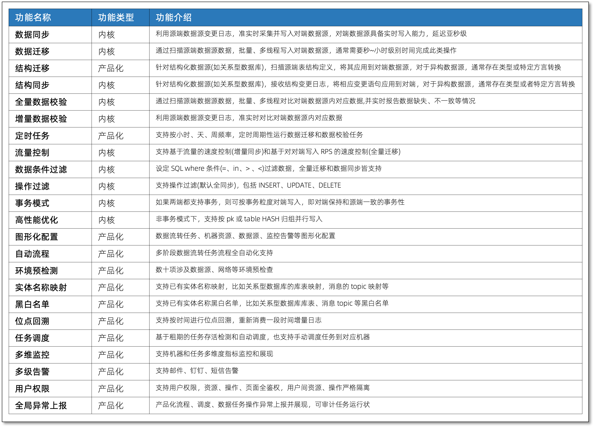
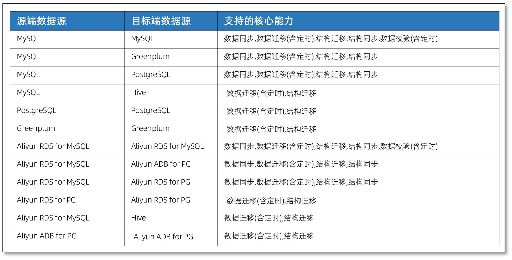

---
id:product_func
title: 产品功能
---

CloudCanal 具备丰富的功能以满足业务数据流通场景的需求，本篇文章简要介绍该产品具备的主要能力。

## 功能介绍

## 核心能力数据源支持

核心能力指数据同步、数据迁移(含定时)、结构迁移、结构同步、数据校验(含定时)。

## 数据源支持计划

CloudCanal 在构筑基础能力之后，将逐步添加更多数据源，以源端和目标端作为分类。
- 源端
  - PostgreSQL
  - SQL Server
  - MongoDB
  - Kafka
  - Aliyun PolarDB for MySQL
  - Aliyun DRDS(PolarDB-X)
- 目标端
  - Kafka
  - RocketMQ
  - RabbitMQ
  - Aliyun MQ (Kafka,RocketMQ,RabbitMQ)
  - ElasticSearch
  - TiDB
  - Aliyun ADB for MySQL
  - Hbase
  - Kudu 
  - ClickHouse 