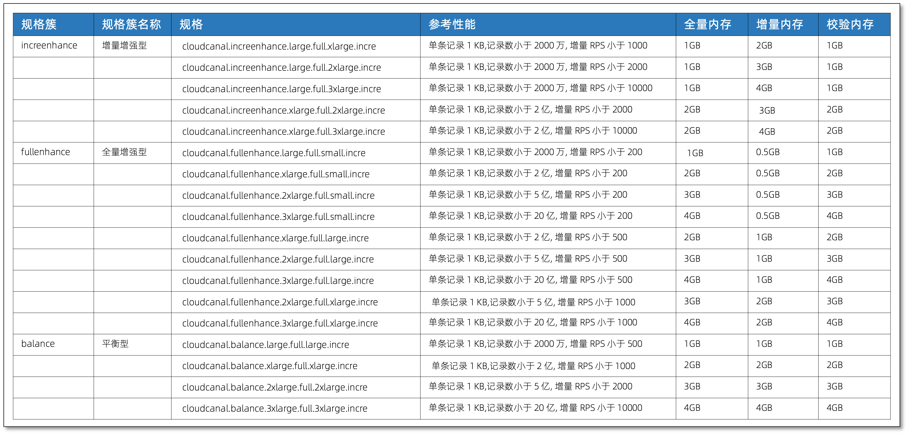

---
id:product_spec_perf
title: 产品规格
---

CloudCanal 规格定义为全量数据迁移、增量数据同步、全量数据校验各个任务进程资源大小的组合。本文档主要描述具体规格，以及对应参考规格性能。

## 规格与参考性能对照表

性能参考说明:
- 记录数参考主要关注 12 小时能迁移数据数量，和上限无关
- 增量 RPS 性能和网络环境、迁移机器压力、数据源种类、数据源能力大小相关
- 增量 RPS 性能数据主要为非事务模式同步

## 机器和规格选择建议

CloudCanal 建议您选择 CPU 内存比 1:4 或 1:8 虚拟机或托管云服务器，或直接大内存物理机，以便容纳更多的任务，一般负载要求的数据迁移同步任务都可满足。

CloudCanal 计费模型和任务规格没关系，规格主要作用是在匹配数据流动需求前提下，尽可能提高机器利用率，
所以在机器条件允许的情况下，选择较高任务规格，无论性能还是稳定性相对较好。
