本文档以阿里云 ECS 为迁移同步机器，阿里云 RDS for MySQL 为数据源，演示如何从 0 到 1 快速构建出一条带结构迁移、数据初始化以的数据同步任务。

### 前置条件

- 工作机器准备
  - 准备 1 台阿里云 ECS (具备 SNAT 或 EIP 或 公网IP),华东1(杭州) 区域,推荐 2C8G、4C8G 或更好的机器
- 源和目标数据库准备
  - 准备测试用 RDS for MySQL, 源端和目标端各一台，华东1(杭州) 区域，规格不限，网络不限

### 创建集群

- **机器管理** > **新增集群**

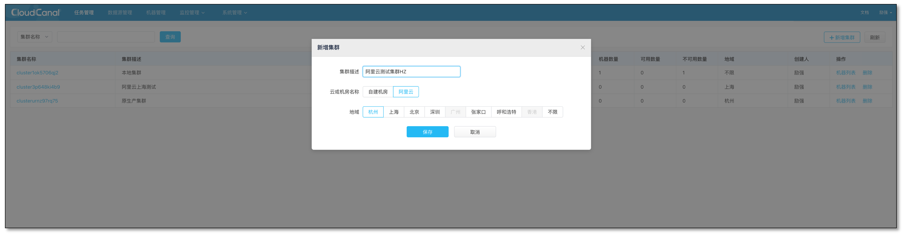

### 添加机器

- 选择刚创建的集群，进入 **机器列表**
- 点击右上角 **添加机器**
- 选择 **阿里云** , **杭州** 区域 ，点击 **获取机器列表**
- 选择工作机器并确认添加

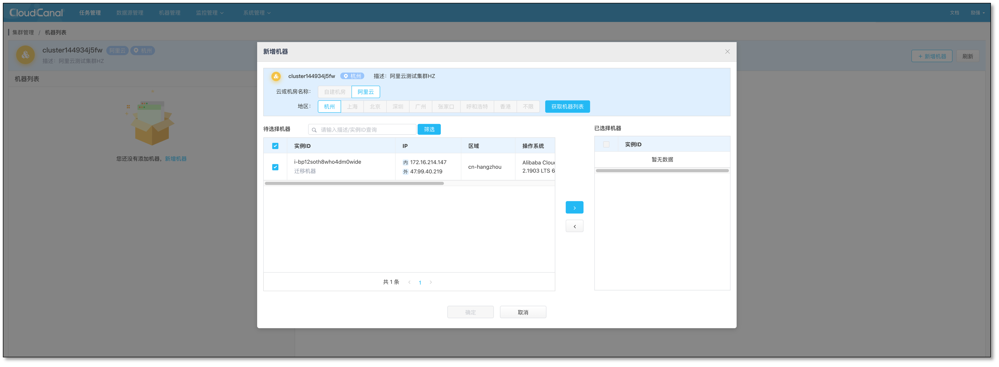

- 机器将自动安装 CloudCanal 客户端包，并且自动安装
- 等待数十秒之后，刷新并点击机器条目 **启动** 按钮，IP 旁小圆点变成绿色即机器添加成功

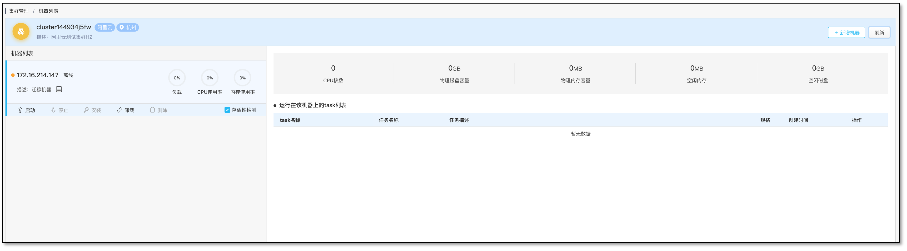

### 添加数据源

- **数据源管理** > **新增数据源**
- 选择 **阿里云**, **RDS for MySQL** ，**杭州** 区域 ,点击获取 **数据源列表** 
- 选择出现的数据源
- 点击下一步

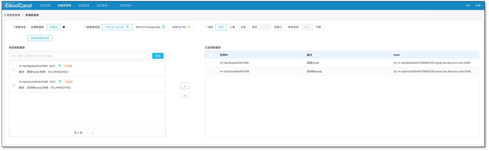

- 选择刚 **添加机器白名单** 到 RDS, 源和目标都需要设置
- 点击下一步

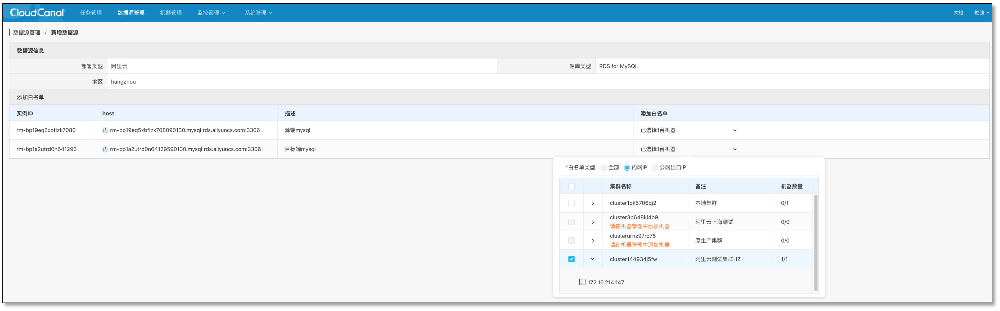

- 勾选 **自动创建** 账号
- 确认添加

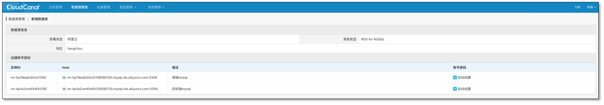

### 创建任务

- **任务管理** > **创建任务**
- 选择 **任务运行集群** 
- 选择源和目标数据源并点击 **测试连接**
- 选择需要 **迁移同步或校验的数据库**
- 单机下一步

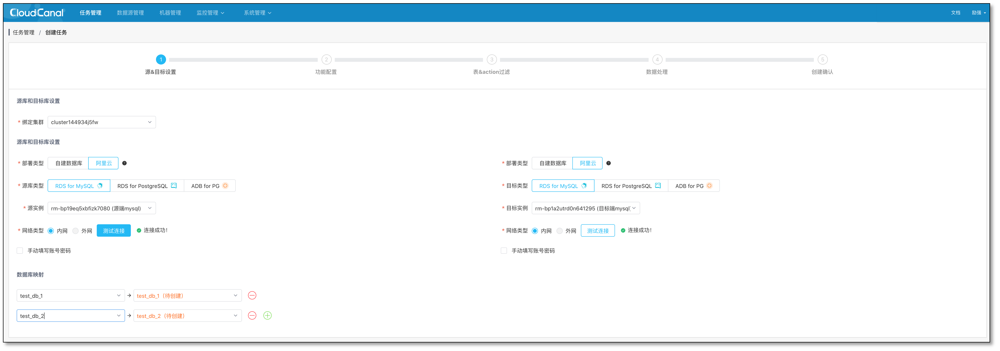 

- 选择数据业务类型 **数据同步**，默认附带 **数据初始化**
- 选择 **规格** ,默认平衡型 2G 规格即可
- 点击下一步

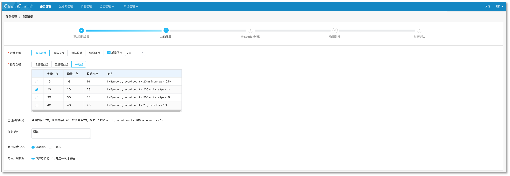

- 选择表，默认即可
- 点击下一步

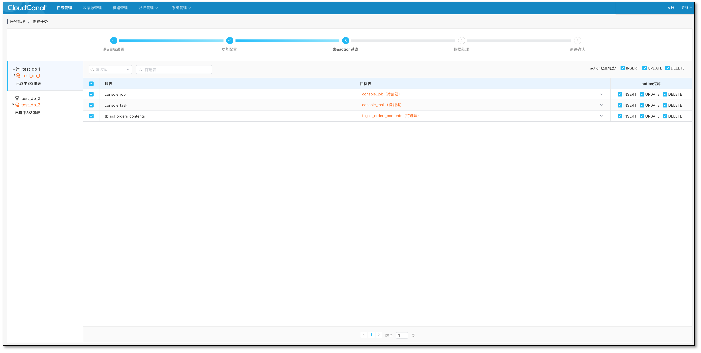

- 选择列，默认即可
- 点击下一步

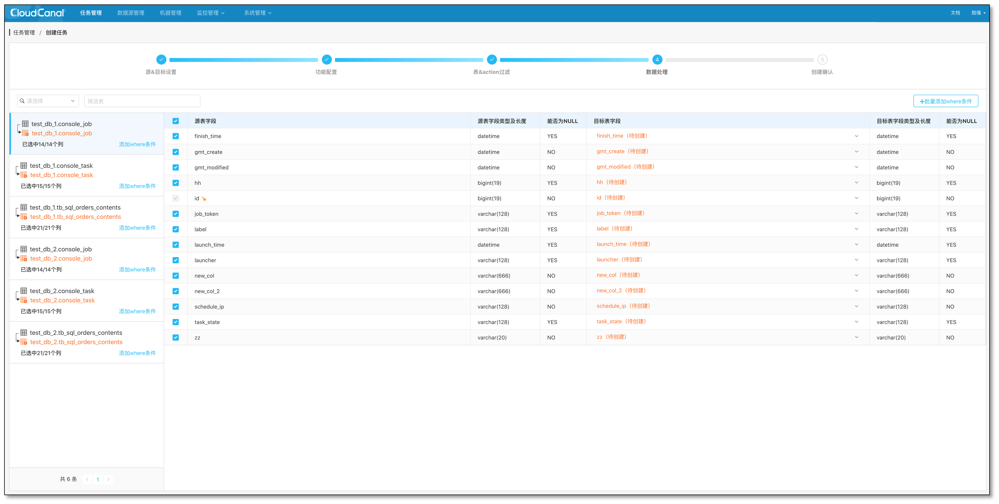

- 确认创建任务

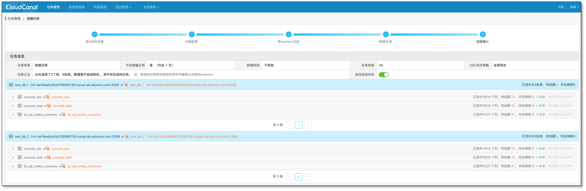

### 任务正常运行

- 任务创建成功后，会默认进行结构迁移(可选)、全量迁移、增量同步，进度条会逐步发生变化

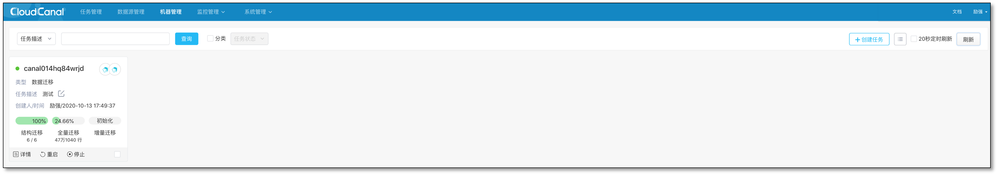