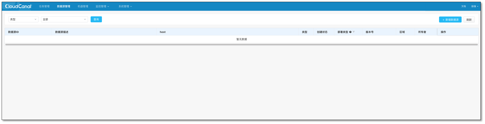
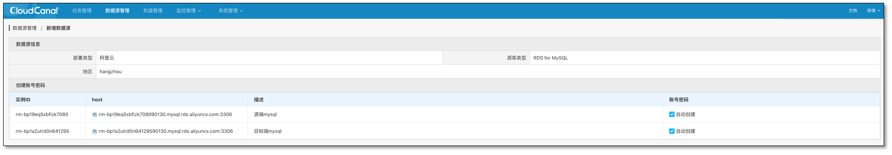
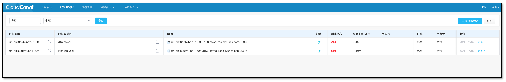
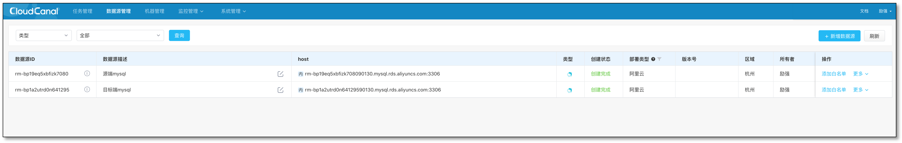

CloudCanal 支持自建数据源和云托管数据源，本文档简要介绍如何添加云托管数据源到 CloudCanal 中，以阿里云 RDS for MySQL 为示例。

### 数据源添加入口

### 查询并选择数据源

- 选择 **阿里云** , **数据源类型** 和相应 **区域** 查询 RDS
- CloudCanal 区域和 Aliyun Region 存在 [对应关系](region_mapping.md)
- 此步可能需要填写阿里云具备[申请临时访问授权的AK/SK](aliyun_ram_sts_auth.md)

### 白名单自动添加

- 此步骤可以选择添加某一集群机器 ip 白名单加入到对应  RDS 中

### 自动创建账号

- 选择是否自动添加供 CloudCanal 访问的账号，默认为读写权限的普通账号

### 确定信息并添加

- 点击确认后，数据源创建状态为创建中，此时系统会有异步后台任务根据创建时选项自动添加白名单和创建账号

- **创建完毕** 表示任务已经添加到系统中

