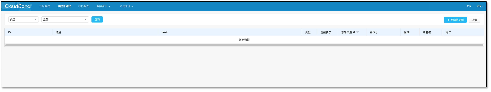
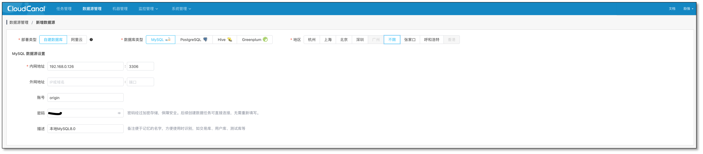
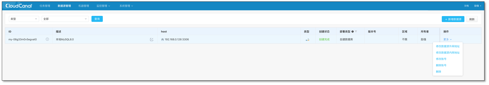

CloudCanal 支持自建数据源和云托管数据源，本文档简要介绍如何添加自建数据源到 CloudCanal 中，本地搭建的 MySQL 为示例。

### 数据源添加入口

### 填写数据源明细

- 选择 **自建数据库** , 区域选择 **不限** 或根据实际情况选择，自建数据库区域非强依赖属性。点击下方确定添加。

### 查看数据源

- 数据源 **创建状态** 为创建完成。

