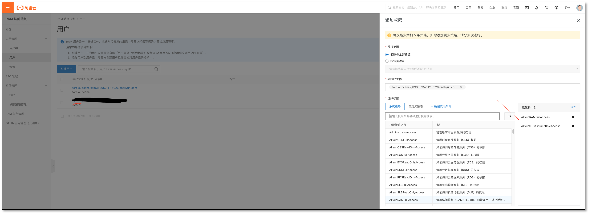

当使用 CloudCanal 对阿里云云数据库、消息或者大数据产品进行数据迁移同步时，CloudCanal 会使用用户提供的阿里云子账号的 AccessKey 和 SecretKey 申请临时授权(sts token),
并使用此 token 进行必要的阿里云资源信息访问。本文档简要介绍如何创建子账号(可选)并授权必要的权限。

### 进入[阿里云(RAM)控制台](https://ram.console.aliyun.com/users)
如果有可用子账号，请确认该子账号具备 **编程访问能力** 且能提供该账号 AccessKey 和 SecretKey，点击对应子账号右侧添加权限。其他情况则 **新建用户** 。

### 新建用户(可选)

- 创建用户请先取一个名字(如 forcloudcanal)，并且 **勾选编程访问** 。

  

- **创建后请记录 AccessKey 和 SecretKey ,后者只在创建时显示一次，建议本地文本记录或者下载 CSV 文件**,如错过记录请删除重建。

  

### 授予权限

- 授予所选子账号 AliyunRAMFullAccess 和 AliyunSTSAssumeRoleAccess 权限。

  

  

### 填写已授权 AK & SK

- 进入 CloudCanal 控制台，点击右上角 **个人中心**，选择 **阿里云临时访问权限**，填写刚创建用户 AccessKey 和 SecretKey 申请临时访问权限。

  