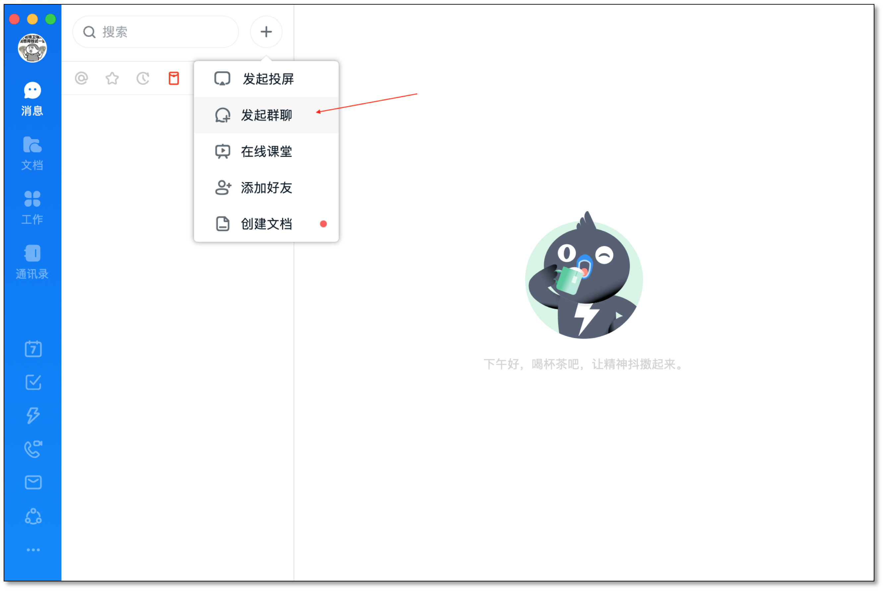
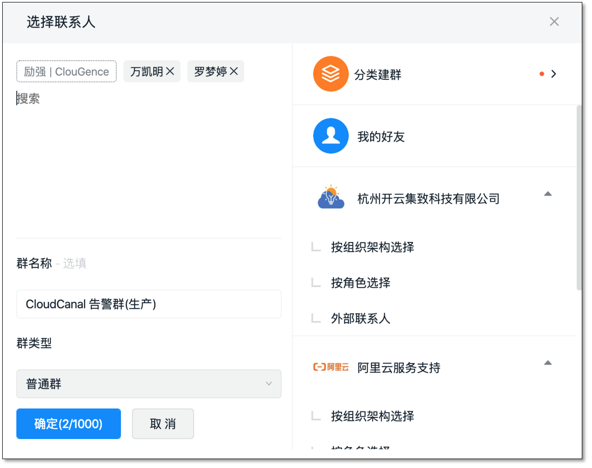
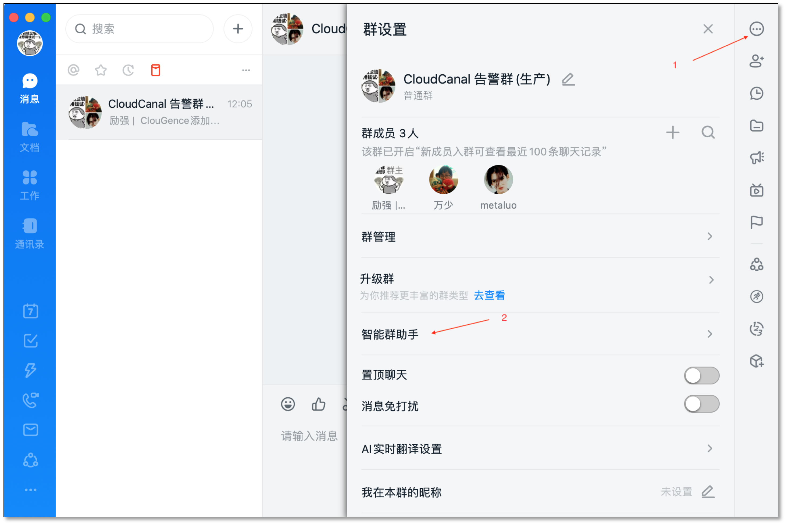
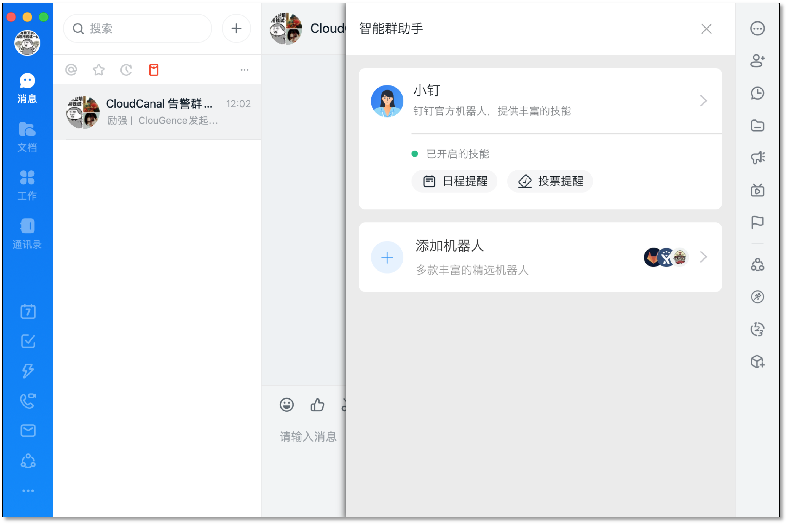
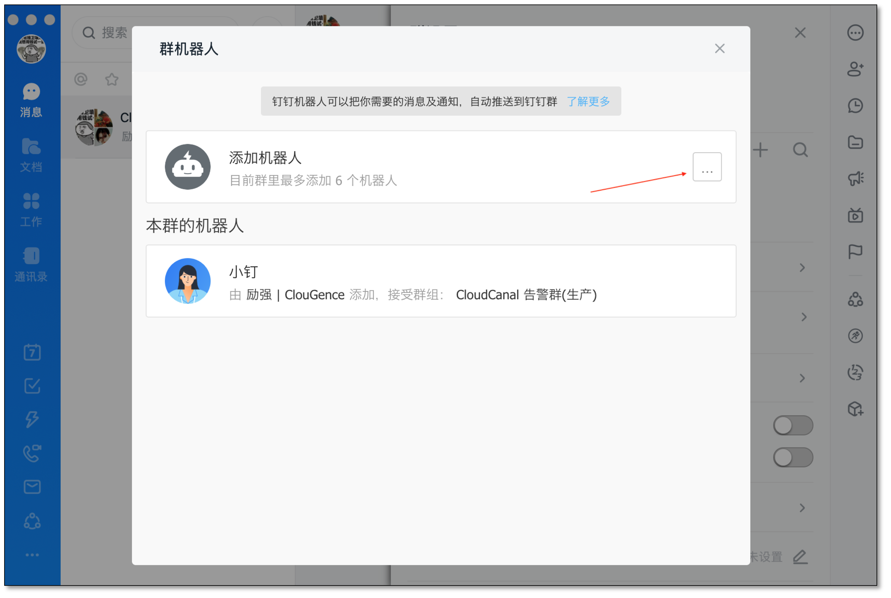
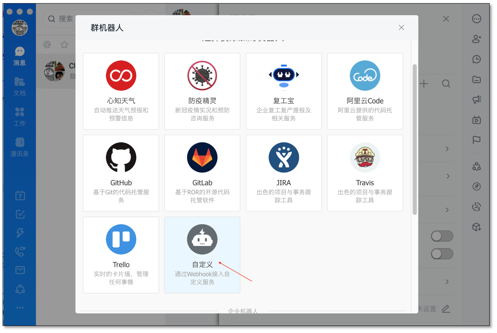
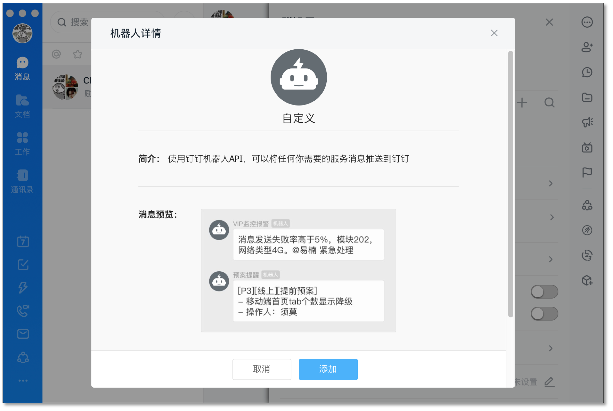
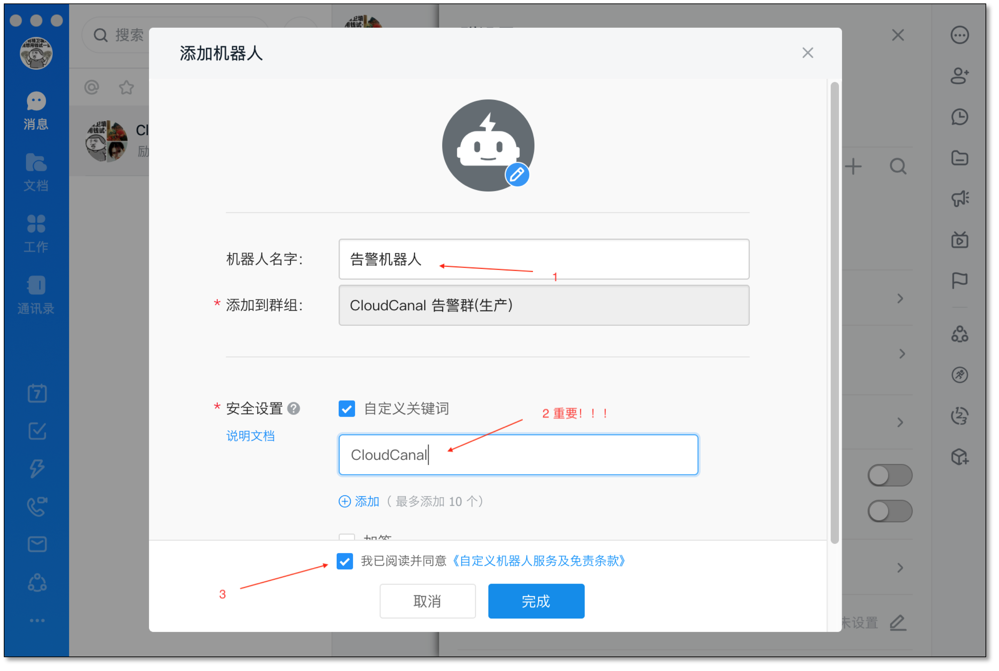
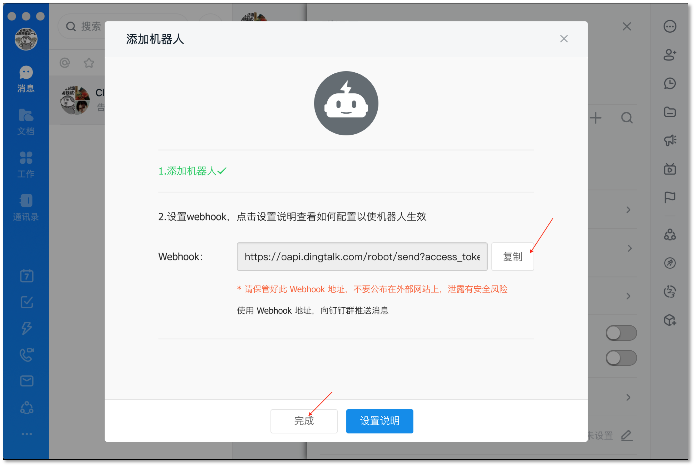
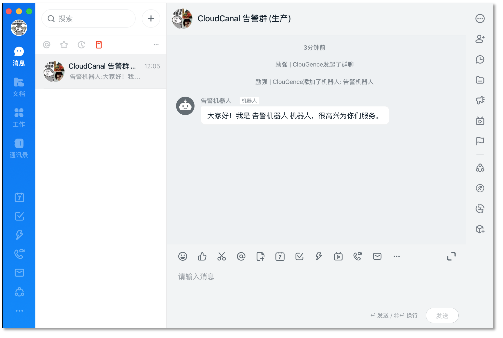

CloudCanal 通过设置钉钉群自定义机器人 webhook,发送告警信息到钉钉群中。本文档简要介绍如何获得有效 webhook 以供使用。

### 安装钉钉

- [下载钉钉](https://www.dingtalk.com/download),并安装,如已安装则略过
- 注册或登录,如已登录则略过

### 创建钉钉群

- 创建群入口

  

-  创建群最少需要 3 个人,群名称请选择容易理解的名词
  

### 创建机器人

- 创建机器人入口

  

  

  
 
- 选择自定义类型机器人
 
  
  
  

- 设置机器人,机器人名字请选择容易理解的名词，**自定义关键字** 请直接设置 **CloudCanal** ,否则告警内容将无法匹配发送。

  

  
### 获取机器人 webhook

- 创建最后一步，可获取机器人 webhook。也可以创建后，通过**群设置>智能群助手>您创建的机器人**查看获取。
  

  
### 创建成功

- 钉钉告警群创建成功后，并且在 CloudCanal **个人中心>告警配置** 填写钉钉机器人webhook, 后续 CloudCanal 任务告警将发送到此群中。
  