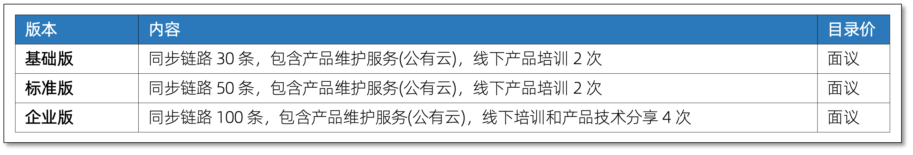
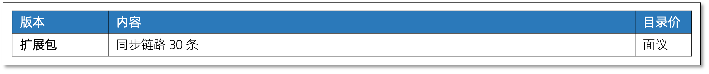
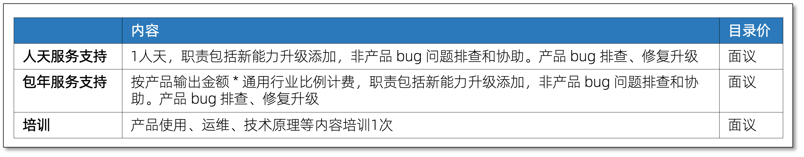

---
id:product_price
title: 产品定价
---

CloudCanal 定价包含 PaaS 按需使用方式和全套多规格云上私有输出方式。本文档简要描述上述两种定价细节。

## PaaS 按需使用定价

PaaS 按需使用定价维度包含 *时长* 和 *次数* ,其中时长维度主要用于长周期功能,次数用于短周期能力。

- 价格说明:
  - 增量同步不限制 TPS, 全量迁移和数据校验不限数据量大小，规格只为机器利用率服务
  - 增量时长可以多条链路共享，创建但不运行链路不计费
  - 增量同步暂停/异常不计费
  - 全量迁移、数据校验、结构迁移以任务完成为计费点
  - 本表价格为不含折扣价格，实际不同时长、次数、种类组合套餐拥有不同折扣

## 多规格云上私有输出定价

多规格云上私有输出定价维度包含增量同步链路条数，不限规格。具体价格请联系我们。

### 基础规格

### 扩展包

### 服务与培训

- 报价说明
  - 本报价不包含应用使用的数据库和部署本产品的资源，需用户自行提供，具体参考版本部署资源说明
  - 本报价涉及具体折扣以商务谈判为准
  

